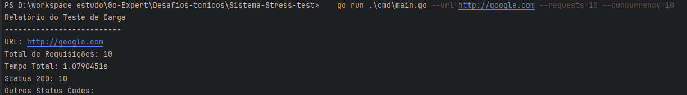
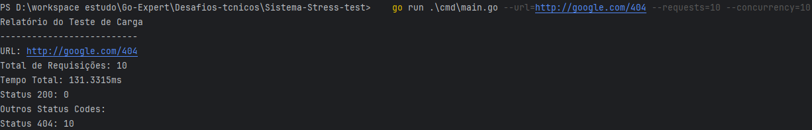
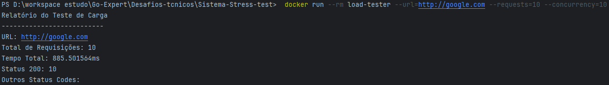

# Load Tester CLI

O Load Tester CLI é uma ferramenta desenvolvida em Go para realizar testes de carga em serviços web. Ele permite que você forneça uma URL, o número total de requisições e a quantidade de chamadas simultâneas, e então gera um relatório detalhado após a execução dos testes.

## Funcionalidades

- Realiza requisições HTTP para a URL especificada.
- Distribui as requisições de acordo com o nível de concorrência definido.
- Gera um relatório com:
    - Tempo total gasto na execução.
    - Quantidade total de requisições realizadas.
    - Quantidade de requisições com status HTTP 200.
    - Distribuição de outros códigos de status HTTP (como 404, 500, etc.).

## Pré-requisitos

- Docker instalado.
- Go (opcional, caso queira rodar localmente sem Docker).

## Como usar sem o Docker
* Code 200

   ```sh
   go run .\cmd\main.go --url=https://fullcycle.com.br --requests=10 --concurrency=10    
   ```


* Code 404
   ```sh
   go run .\cmd\main.go --url=https://google.com/404 --requests=10 --concurrency=10    
   ```


### Usando Docker

1. **Construa a imagem Docker:**

   ```sh
   docker build -t load-tester .
   ```

2. Execute o container Docker: 

Para executar direto no container Docker https é necessário configurando o Docker Engine para acesso remoto com TLS


```sh
  docker run --rm load-tester --url=http://google.com.br/404 --requests=10 --concurrency=10
```




_Eu verifiquei e vi que não tem erro de programação, o problema é quando executa o programa direto do Docker_
Utilizar o "Como usar sem o Docker", está funcionando com https

## Configurando o Docker Engine para acesso remoto com TLS

https://www.ibm.com/docs/pt-br/addi/6.1.2?topic=prerequisites-configuring-docker-engine-remote-access-tls


