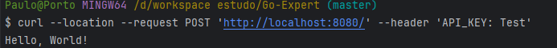
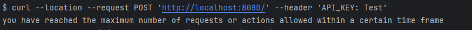

# Rate Limiter em Go

Este projeto implementa um rate limiter em Go, utilizando Redis ou armazenamento em memória para armazenar os dados de limitação. O rate limiter pode ser configurado para limitar o número máximo de requisições por segundo com base em um endereço IP específico ou em um token de acesso.

## Funcionalidades

- **Limitação por IP**: Restringe o número de requisições recebidas de um único endereço IP dentro de um intervalo de tempo definido.
- **Limitação por Token de Acesso**: Restringe o número de requisições com base em um token de acesso único. A configuração do token sobrepõe a configuração de IP.
- **Persistência Configurável**: Permite trocar facilmente o mecanismo de persistência entre Redis e armazenamento em memória.
- **Configuração via Arquivo `.env`**: Configurações de limite e persistência são realizadas via variáveis de ambiente.

## Configuração

As configurações são definidas no arquivo `.env` na pasta raiz do projeto. Exemplo de arquivo `.env`:


- `STORAGE_TYPE`: Define o tipo de armazenamento (`redis` ou `memory`).
- `RATE_LIMIT_IP`: Número máximo de requisições por segundo permitido por IP.
- `RATE_LIMIT_TOKEN`: Número máximo de requisições por segundo permitido por token.
- `BLOCK_TIME`: Tempo de bloqueio em segundos após exceder o limite de requisições.
- `REDIS_ADDR`: Endereço do Redis.
- `REDIS_PASSWORD`: Senha do Redis.
- `REDIS_DB`: Número do banco de dados Redis a ser utilizado.

## Como Executar

### Subir o Redis utilizando Docker

1. Certifique-se de ter o Docker instalado.
2. Suba o Redis utilizando Docker Compose:

```sh
docker-compose up -d
```

### 1. Executar a Aplicação
```sh
go mod tidy
```
### 1. Executar a Aplicação

```sh
go run main.go
```
A aplicação estará disponível na porta 8080.

### Testes
Para rodar os testes, execute o seguinte comando:
```sh
go test ./limiter-config
```

### Estrutura do Projeto

* main.go: Inicializa o servidor web e aplica o middleware.
* server\middleware.go: Define o middleware do rate limiter.
* limiter-config\limiter.go: Contém a lógica de limitação.
* config\config.go: Lê e gerencia a configuração do rate limiter.
* storage\redis.go: Implementa a persistência com Redis.
* storage\memory.go: Implementa a persistência em memória.
* storage\storage.go: Define a interface de persistência.
* docker-compose.yml: Define os serviços Docker, incluindo Redis.
* .env: Arquivo de configuração.

## Exemplo de Uso
### Limitação por IP
Se o rate limiter estiver configurado para permitir no máximo 5 requisições por segundo por IP:

O IP 192.168.1.1 enviar 6 requisições em um segundo, a sexta requisição será bloqueada.
A mensagem de resposta será:

    Código HTTP: 429
    Mensagem: you have reached the maximum number of requests or actions allowed within a certain time frame


## Limitação por Token
Se um token *abc123* tiver um limite configurado de 10 requisições por segundo:

O token enviar 11 requisições nesse intervalo, a décima primeira será bloqueada.
A mensagem de resposta será:

    Código HTTP: 429
    Mensagem: you have reached the maximum number of requests or actions allowed within a certain time frame


## Estratégia de Persistência
A persistência pode ser facilmente trocada entre Redis e armazenamento em memória através da variável STORAGE_TYPE no arquivo .env.

### Usando Redis
Defina STORAGE_TYPE=redis e configure os parâmetros de conexão do Redis.

### Usando Armazenamento em Memória
Defina STORAGE_TYPE=memory para usar o armazenamento em memória. Essa opção é útil para testes ou ambientes onde o Redis não está disponível.


### Test api examples 
```sh
curl --location --request POST 'http://localhost:8080/' --header 'API_KEY: Test'
```
### Ok 
 

### The maximum number of requests
