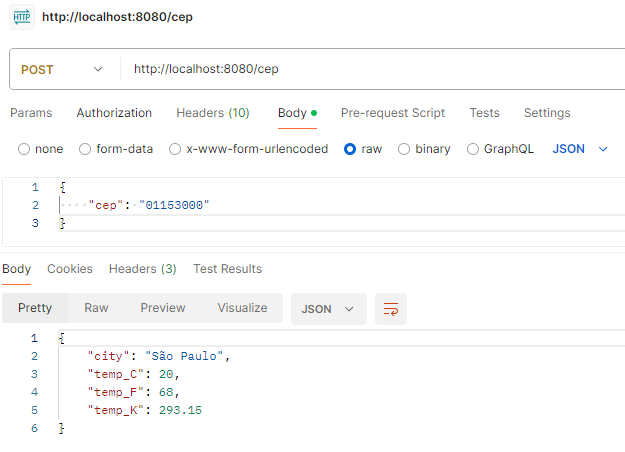
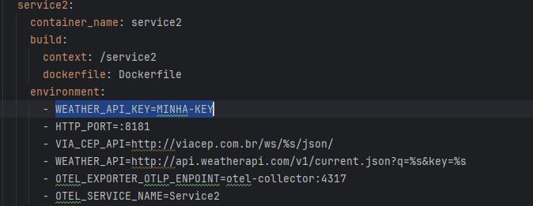
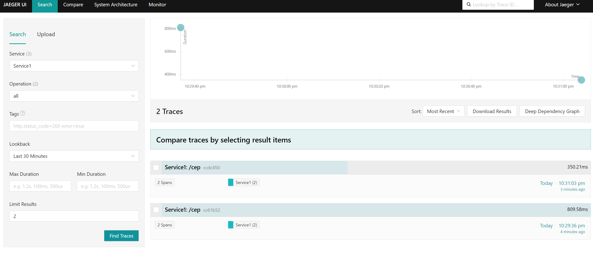
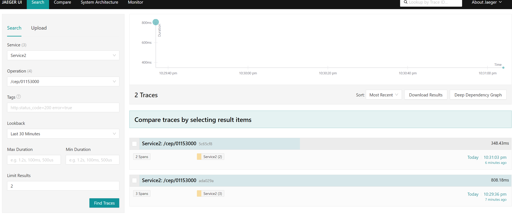

## Tracing distribuído e span
<b>Objetivo:</b> Desenvolver um sistema em Go que receba um CEP, identifica a cidade e retorna o clima atual (temperatura em graus celsius, fahrenheit e kelvin) juntamente com a cidade. Esse sistema deverá implementar OTEL(Open Telemetry) e Zipkin.

Basedo no cenário conhecido _"Sistema de temperatura por CEP"_ denominado <b>Serviço B</b>, será incluso um novo projeto, denominado <b>Serviço A.</b>

### Requisitos - Serviço A (responsável pelo input):
 
* O sistema deve receber um input de 8 dígitos via POST, através do schema:  { "cep": "29902555" }
* O sistema deve validar se o input é valido (contem 8 dígitos) e é uma STRING
  * Caso seja válido, será encaminhado para o <b>Serviço B</b> via HTTP
  * Caso não seja válido, deve retornar:
    * Código HTTP: <b>422</b>
    * Mensagem: <b>invalid zipcode</b>

### Requisitos - Serviço B (responsável pela orquestração):

* O sistema deve receber um CEP válido de 8 digitos
* O sistema deve realizar a pesquisa do CEP e encontrar o nome da localização, a partir disso, deverá retornar as temperaturas e formata-lás em: Celsius, Fahrenheit, Kelvin juntamente com o nome da localização.
* O sistema deve responder adequadamente nos seguintes cenários:
  * Em caso de sucesso:
    * Código HTTP: 200
    * Response Body: { "city: "São Paulo", "temp_C": 28.5, "temp_F": 28.5, "temp_K": 28.5 }
  * Em caso de falha, caso o CEP não seja válido (com formato correto):
    * Código HTTP: 422
    * Mensagem: invalid zipcode
  * Em caso de falha, caso o CEP não seja encontrado:
    * Código HTTP: 404
    * Mensagem: can not find zipcode

Após a implementação dos serviços, adicione a implementação do OTEL + Zipkin:
* Implementar tracing distribuído entre Serviço A - Serviço B
* Utilizar span para medir o tempo de resposta do serviço de busca de CEP e busca de temperatura

### Dicas:

* Utilize a API viaCEP (ou similar) para encontrar a localização que deseja consultar a temperatura: https://viacep.com.br/
* Utilize a API WeatherAPI (ou similar) para consultar as temperaturas desejadas: https://www.weatherapi.com/
* Para realizar a conversão de Celsius para Fahrenheit, utilize a seguinte fórmula: F = C * 1,8 + 32
  * Para realizar a conversão de Celsius para Kelvin, utilize a seguinte fórmula: K = C + 273
  * Sendo F = Fahrenheit
  * Sendo C = Celsius
  * Sendo K = Kelvin
* Para dúvidas da implementação do OTEL, você pode [clicar aqui](https://opentelemetry.io/docs/languages/go/getting-started/)
* Para implementação de spans, você pode [clicar aqui](https://opentelemetry.io/docs/languages/go/instrumentation/#creating-spans)
* Você precisará utilizar um serviço de [collector do OTEL](https://opentelemetry.io/docs/collector/quick-start/)
* Para mais informações sobre Zipkin, você pode [clicar aqui](https://zipkin.io/)

### Entrega:

* O código-fonte completo da implementação.
* Documentação explicando como rodar o projeto em ambiente dev.
* Utilize docker/docker-compose para que possamos realizar os testes de sua aplicação.

### Exemplo
      curl --location 'http://localhost:8080/cep' \
        --header 'Content-Type: application/json' \
        --data '{
            "cep": "01153000"
        }'

       

### Como fazer o deploy com docker
Alterar as informação da WEATHER_API_KEY no docker-compose.yaml

### Service1

## Service2

### Zipkin

