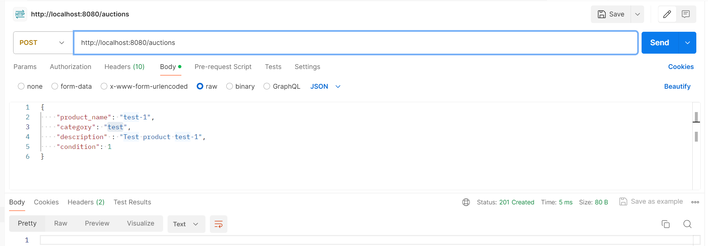
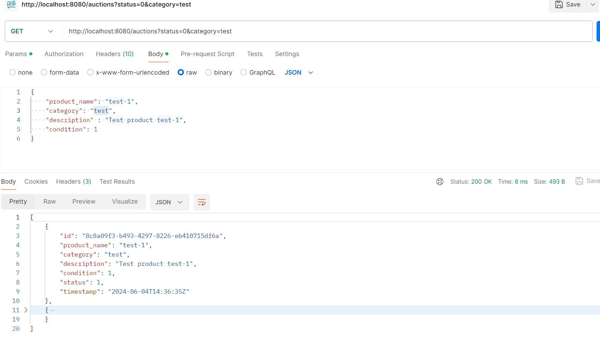
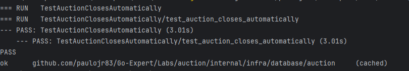

## Abertura e fechamento do Leilão - Go Routines

<b>Objetivo:</b> Adicionar uma nova funcionalidade ao projeto já existente para o leilão fechar automaticamente a partir de um tempo definido.

Clone o seguinte repositório: [clique para acessar o repositório.](https://github.com/devfullcycle/labs-auction-goexpert)

Toda rotina de criação do leilão e lances já está desenvolvida, entretanto, o projeto clonado necessita de melhoria: adicionar a rotina de fechamento automático a partir de um tempo.

Para essa tarefa, você utilizará o go routines e deverá se concentrar no processo de criação de leilão (auction). A validação do leilão (auction) estar fechado ou aberto na rotina de novos lançes (bid) já está implementado.

<b>Você deverá desenvolver:</b>
* Uma função que irá calcular o tempo do leilão, baseado em parâmetros previamente definidos em variáveis de ambiente;
* Uma nova go routine que validará a existência de um leilão (auction) vencido (que o tempo já se esgotou) e que deverá realizar o update, fechando o leilão (auction);
* Um teste para validar se o fechamento está acontecendo de forma automatizada;

<b>Dicas:</b>
* Concentre-se na no arquivo internal/infra/database/auction/create_auction.go, você deverá implementar a solução nesse arquivo;
* Lembre-se que estamos trabalhando com concorrência, implemente uma solução que solucione isso:
* Verifique como o cálculo de intervalo para checar se o leilão (auction) ainda é válido está sendo realizado na rotina de criação de bid;
* Para mais informações de como funciona uma goroutine, clique aqui e acesse nosso módulo de Multithreading no curso Go Expert;

<b>Entrega:</b>
* O código-fonte completo da implementação.
* Documentação explicando como rodar o projeto em ambiente dev.
* Utilize docker/docker-compose para podermos realizar os testes de sua aplicação.

### Como executar o Programa

* Confirações de variaveis 

      - MONGODB_URL=mongodb://mongodb:27017
      - MONGODB_DB=auctions
      - BATCH_INSERT_INTERVAL=7m
      - MAX_BATCH_SIZE=10
      - AUCTION_DURATION_SECONDS=15 #tempo que o auction ficara ativo
      - HTTP_PORT=:8080 

## executar via docker
    
    $ docker-compose up -d

### Exemplo de criação do autions
    
    POST http://localhost:8080/auctions HTTP/1.1
    Host: localhost:8080
    Content-Type: application/json
    Content-Length: 124
    
    {
    "product_name": "test-1",
    "category": "test",
    "description" : "Test product test-1",
    "condition": 1
    }

### Exemplo de busca do autions

    GET http://localhost:8080/auctions?status=0&category=test HTTP/1.1
    Host: localhost:8080
    Content-Type: application/json
    Content-Length: 124
    
    {
    "product_name": "test-1",
    "category": "test",
    "description" : "Test product test-1",
    "condition": 1
    }

### Executar o teste

    $ go test -v github.com/paulojr83/Go-Expert/Labs/auction/internal/infra/database/auction

