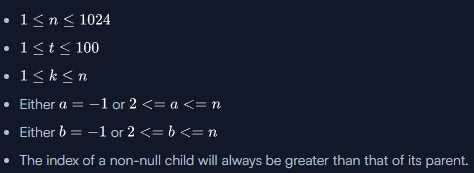

## Swap Nodes [Algo]

A binary tree is a tree which is characterized by one of the following properties:

* It can be empty (null).
* It contains a root node only.
* It contains a root node with a left subtree, a right subtree, or both. These subtrees are also binary trees.

In-order traversal is performed as

1. Traverse the left subtree.
2. Visit root.
3. Traverse the right subtree.

For this in-order traversal, start from the left child of the root node and keep exploring the left subtree until you reach a leaf. When you reach a leaf, back up to its parent, check for a right child and visit it if there is one. If there is not a child, you've explored its left and right subtrees fully. If there is a right child, traverse its left subtree then its right in the same manner. Keep doing this until you have traversed the entire tree. You will only store the values of a node as you visit when one of the following is true:

* it is the first node visited, the first time visited
* it is a leaf, should only be visited once
* all of its subtrees have been explored, should only be visited once while this is true
* it is the root of the tree, the first time visited

__Swapping:__ Swapping subtrees of a node means that if initially node has left subtree L and right subtree R, then after swapping, the left subtree will be R and the right subtree, L.

For example, in the following tree, we swap children of node 1.

        Depth
        1               1            [1]
        / \             / \
        2   3     ->    3   2          [2]
        \   \           \   \
        4   5           5   4        [3]
In-order traversal of left tree is 2 4 1 3 5 and of right tree is 3 5 1 2 4.

__Swap operation:__

We define depth of a node as follows:

* The root node is at depth 1.
* If the depth of the parent node is d, then the depth of current node will be d+1.

Given a tree and an integer, k, in one operation, we need to swap the subtrees of all the nodes at each depth h, where h ∈ [k, 2k, 3k,...]. In other words, if h is a multiple of k, swap the left and right subtrees of that level.

You are given a tree of n nodes where nodes are indexed from [1..n] and it is rooted at 1. You have to perform t swap operations on it, and after each swap operation print the in-order traversal of the current state of the tree.

### Function Description

Complete the swapNodes function in the editor below. It should return a two-dimensional array where each element is an array of integers representing the node indices of an in-order traversal after a swap operation.

swapNodes has the following parameter(s):
* indexes: an array of integers representing index values of each , beginning with , the first element, as the root.
* queries: an array of integers, each representing a  value.

### Input Format
The first line contains n, number of nodes in the tree.

Each of the next n lines contains two integers, a b, where a is the index of left child, and b is the index of right child of ith node.

Note: -1 is used to represent a null node.

The next line contains an integer, t, the size of .
Each of the next t lines contains an integer , each being a value .

###  Output Format
For each k, perform the swap operation and store the indices of your in-order traversal to your result array. After all swap operations have been performed, return your result array for printing.

Sample Input 0

    3
    2 3
    -1 -1
    -1 -1
    2
    1
    1

Sample Output 0

    3 1 2
    2 1 3

Explanation 0

As nodes 2 and 3 have no children, swapping will not have any effect on them. We only have to swap the child nodes of the root node.
  
     1   [s]       1    [s]       1   
    / \      ->   / \        ->  / \  
    2   3 [s]     3   2  [s]     2   3

Note: [s] indicates that a swap operation is done at this depth.

Sample Input 1

    5
    2 3
    -1 4
    -1 5
    -1 -1
    -1 -1
    1
    2

Sample Output 1

    4 2 1 5 3

Explanation 1

Swapping child nodes of node 2 and 3 we get

     1                  1  
    / \                / \
    2   3   [s]  ->    2   3
    \   \            /   /
    4   5          4   5  

Sample Input 2

    11
    2 3
    4 -1
    5 -1
    6 -1
    7 8
    -1 9
    -1 -1
    10 11
    -1 -1
    -1 -1
    -1 -1
    2
    2
    4

Sample Output 2

    2 9 6 4 1 3 7 5 11 8 10
    2 6 9 4 1 3 7 5 10 8 11

Explanation 2

Here we perform swap operations at the nodes whose depth is either 2 or 4 for K = 2 and then at nodes whose depth is 4 for K=4.
    
             1                     1                          1             
            / \                   / \                        / \            
           /   \                 /   \                      /   \           
          2     3    [s]        2     3                    2     3          
         /      /                \     \                    \     \         
        /      /                  \     \                    \     \        
        4      5          ->        4     5          ->        4     5       
        /      / \                  /     / \                  /     / \      
        /      /   \                /     /   \                /     /   \     
        6      7     8   [s]        6     7     8   [s]        6     7     8
        \          / \            /           / \              \         / \   
        \        /   \          /           /   \              \       /   \  
        9      10   11        9           11   10              9     10   11 