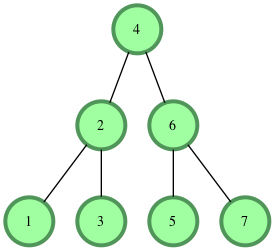
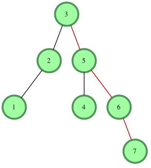

### Tree: Height of a Binary Tree

The height of a binary tree is the number of edges between the tree's root and its furthest leaf. For example, the following binary tree is of height :

_Function Description_

Complete the getHeight or height function in the editor. It must return the height of a binary tree as an integer.

getHeight or height has the following parameter(s):

root: a reference to the root of a binary tree.
Note -The Height of binary tree with single node is taken as zero.

Input Format

The first line contains an integer , the number of nodes in the tree.
Next line contains  space separated integer where th integer denotes node[i].data.

Note: Node values are inserted into a binary search tree before a reference to the tree's root node is passed to your function. In a binary search tree, all nodes on the left branch of a node are less than the node value. All values on the right branch are greater than the node value.

Constraints

Output Format

Your function should return a single integer denoting the height of the binary tree.

Sample Input

Sample Output

3
Explanation

The longest root-to-leaf path is shown below:

There are  nodes in this path that are connected by  edges, meaning our binary tree's .